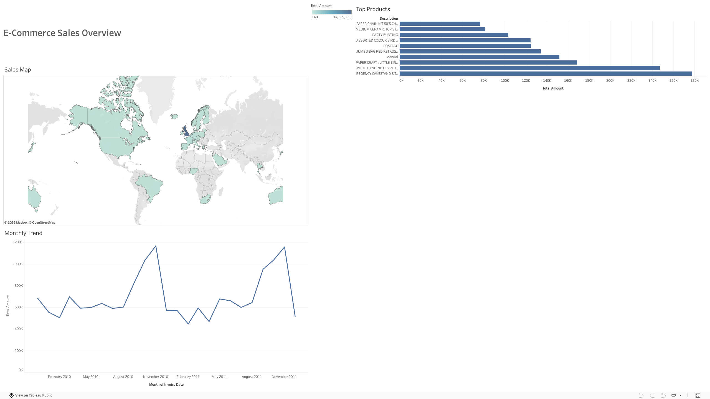

# 🛒 E-Commerce Sales Dashboard (End-to-End Data Pipeline)


*> **[Click here to view the Interactive Dashboard on Tableau Public] https://public.tableau.com/views/E-CommerceSalesDashboard_17681539261150/Dashboard1?:language=en-US&:sid=&:redirect=auth&publish=yes&showOnboarding=true&:display_count=n&:origin=viz_share_link** <*

## 📌 Project Overview
This project analyzes a dataset of **500,000+** online retail transactions to identify customer purchasing patterns and high-value markets. 

The goal was to build a full-stack data pipeline—starting from raw dirty data, moving through a SQL data warehouse, and ending with an interactive dashboard for stakeholders.

## 🛠️ Tech Stack
* **Python (Pandas):** Data cleaning, type conversion, and handling missing values.
* **PostgreSQL:** Relational database storage and aggregation (ETL).
* **SQL:** Writing views to calculate monthly revenue and top-selling products.
* **Tableau:** Building an interactive geospatial dashboard with filtering capabilities.

## 🔍 Key Insights
1.  **Seasonal Trends:** Sales peak significantly in **November/December**, correlating with holiday shopping seasons.
2.  **Top Markets:** While the UK is the primary market, significant growth opportunities exist in **France** and **Germany**.
3.  **Product Drivers:** "Paper Craft" and decorative items are the highest volume drivers, suggesting a strong B2C customer base interested in gifts/crafts.

## ⚙️ Architecture (ETL Pipeline)
1.  **Extract:** Raw CSV data loaded into Python.
2.  **Transform:**
    * Removed cancelled transactions (negative quantities).
    * Parsed date strings into datetime objects.
    * Calculated total transaction value (`Quantity * UnitPrice`).
3.  **Load:** Cleaned data pushed to a local **PostgreSQL** database.
4.  **Visualize:** Connected Tableau to the data source to build the dashboard.

## 💻 How to Run Locally
1.  **Clone the Repo:**
    ```bash
    git clone [https://github.com/hojundev/ecommerce-sales-dashboard.git](https://github.com/hojundev/ecommerce-sales-dashboard.git)
    ```
2.  **Install Dependencies:**
    ```bash
    pip install pandas sqlalchemy psycopg2-binary python-dotenv
    ```
3.  **Database Setup:**
    * Create a local PostgreSQL database named `retail_db`.
    * Create a `.env` file with your database password: `DB_PASS=your_password`.
4.  **Run the Pipeline:**
    * Run `notebooks/database_setup.ipynb` to upload the data and create SQL views.
